# Frosted glass - before and after

Visual comparisons for [microsoft/vscode#337468](https://github.com/microsoft/vscode/pull/337468).

**21 matched comparisons: 10 Editor and 11 Agents surfaces.** Captured on macOS in Code OSS 1.140.0 Dev, using Dark 2026 and synthetic demo data.

- **Before:** the same build with `workbench.modernUIFrostedGlass` disabled, showing the original solid theme backgrounds.
- **After:** frosted glass enabled. Most examples use **50% opacity** to make the material easy to inspect. The Command Palette and provider picker also include explicitly labelled **92% default** examples.
- Popup contents and viewport sizes are checked for equality before a pair is accepted. No chat requests or demo tasks were executed.
- These are feature-off/feature-on comparisons, not screenshots of two different Git revisions.
- Images are hosted on a separate review-assets branch and are not included in the code PR diff.

## Editor window

### Explorer context menu

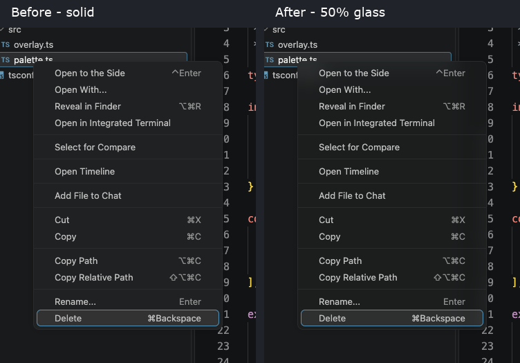

[Before](editor/context-menu-before.png) · [After](editor/context-menu-after.png) · [Full window before](editor/full/context-menu-before.png) · [Full window after](editor/full/context-menu-after.png)

### Editor context menu over source code

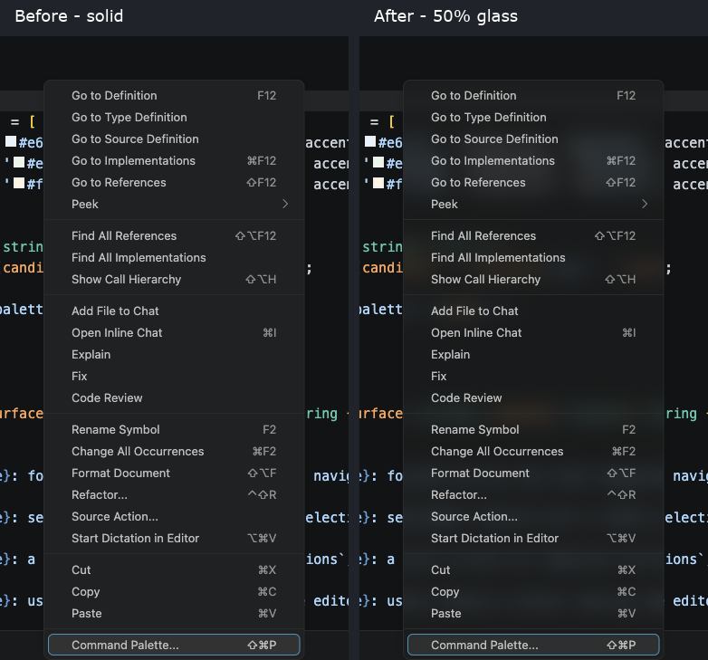

[Before](editor/editor-context-menu-before.png) · [After](editor/editor-context-menu-after.png) · [Full window before](editor/full/editor-context-menu-before.png) · [Full window after](editor/full/editor-context-menu-after.png)

### Toolbar dropdown

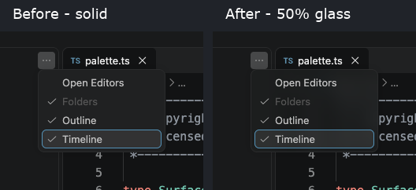

[Before](editor/toolbar-menu-before.png) · [After](editor/toolbar-menu-after.png) · [Full window before](editor/full/toolbar-menu-before.png) · [Full window after](editor/full/toolbar-menu-after.png)

### Nested Themes menu

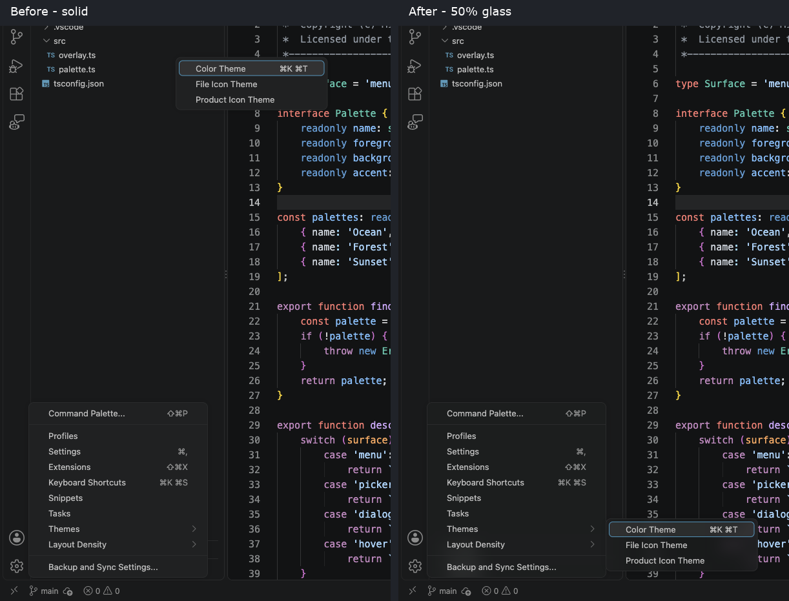

[Before](editor/nested-menu-before.png) · [After](editor/nested-menu-after.png) · [Full window before](editor/full/nested-menu-before.png) · [Full window after](editor/full/nested-menu-after.png)

### Agent picker

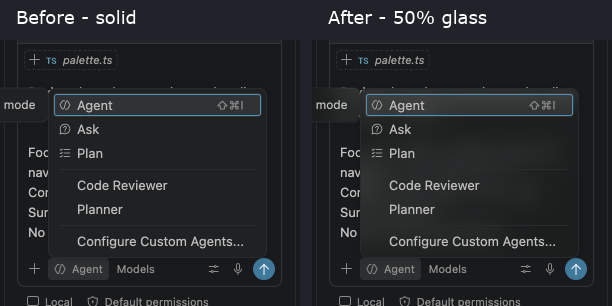

[Before](editor/agent-before.png) · [After](editor/agent-after.png) · [Full window before](editor/full/agent-before.png) · [Full window after](editor/full/agent-after.png)

### Model picker

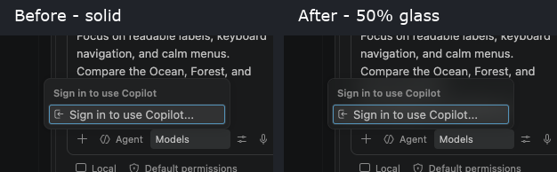

[Before](editor/models-flat-before.png) · [After](editor/models-flat-after.png) · [Full window before](editor/full/models-flat-before.png) · [Full window after](editor/full/models-flat-after.png)

### Tabbed model picker

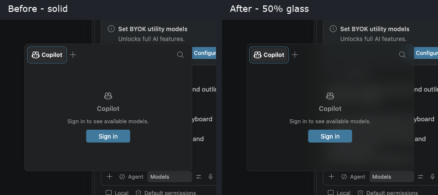

[Before](editor/models-tabbed-before.png) · [After](editor/models-tabbed-after.png) · [Full window before](editor/full/models-tabbed-before.png) · [Full window after](editor/full/models-tabbed-after.png)

### Permission picker

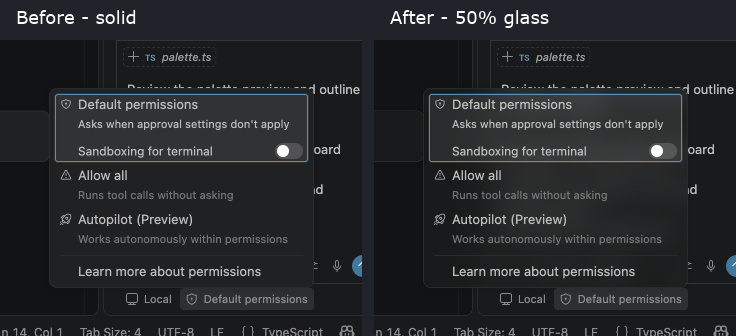

[Before](editor/permissions-before.png) · [After](editor/permissions-after.png) · [Full window before](editor/full/permissions-before.png) · [Full window after](editor/full/permissions-after.png)

### Command Palette - 50% example

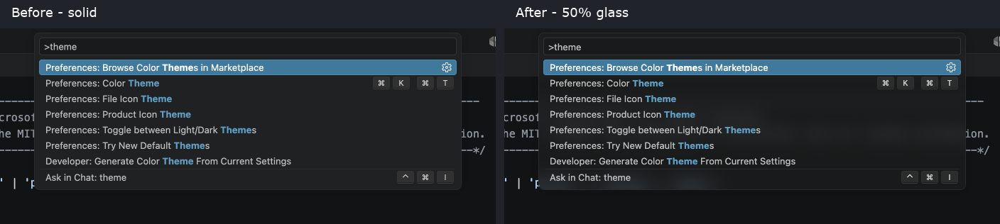

[Before](editor/command-palette-before.png) · [After](editor/command-palette-after.png) · [Full window before](editor/full/command-palette-before.png) · [Full window after](editor/full/command-palette-after.png)

### Command Palette - 92% default

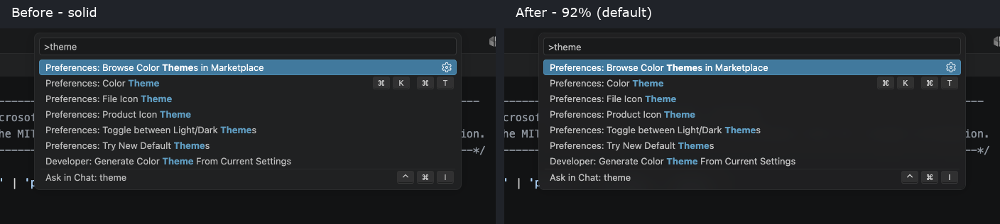

[Before](editor/command-palette-default-before.png) · [After](editor/command-palette-default-after.png) · [Full window before](editor/full/command-palette-default-before.png) · [Full window after](editor/full/command-palette-default-after.png)

## Agents window

### Run/tasks dropdown

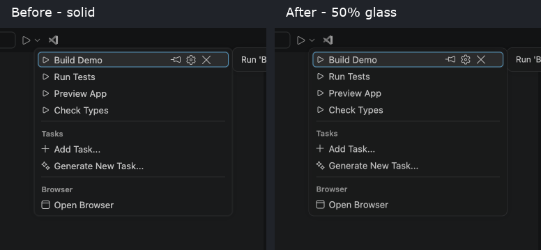

[Before](agents/run-tasks-before.png) · [After](agents/run-tasks-after.png) · [Full window before](agents/full/run-tasks-before.png) · [Full window after](agents/full/run-tasks-after.png)

### Provider picker - 50% example

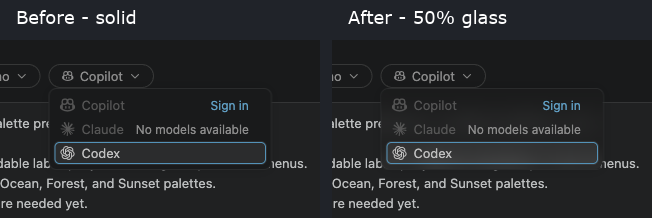

[Before](agents/provider-before.png) · [After](agents/provider-after.png) · [Full window before](agents/full/provider-before.png) · [Full window after](agents/full/provider-after.png)

### Provider picker - 92% default

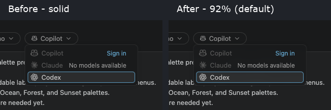

[Before](agents/provider-default-before.png) · [After](agents/provider-default-after.png) · [Full window before](agents/full/provider-default-before.png) · [Full window after](agents/full/provider-default-after.png)

### Custom-agent picker

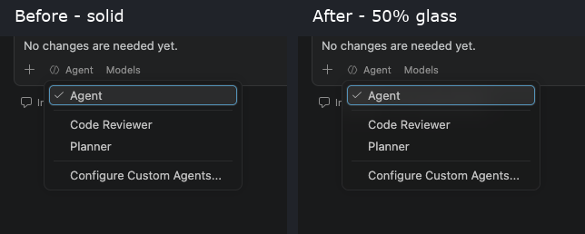

[Before](agents/agent-before.png) · [After](agents/agent-after.png) · [Full window before](agents/full/agent-before.png) · [Full window after](agents/full/agent-after.png)

### Model picker

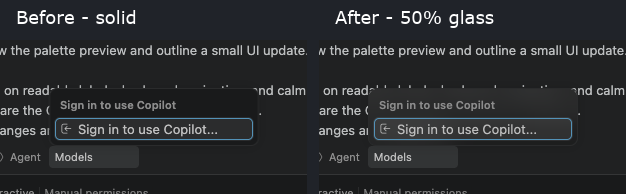

[Before](agents/models-flat-before.png) · [After](agents/models-flat-after.png) · [Full window before](agents/full/models-flat-before.png) · [Full window after](agents/full/models-flat-after.png)

### Tabbed model picker

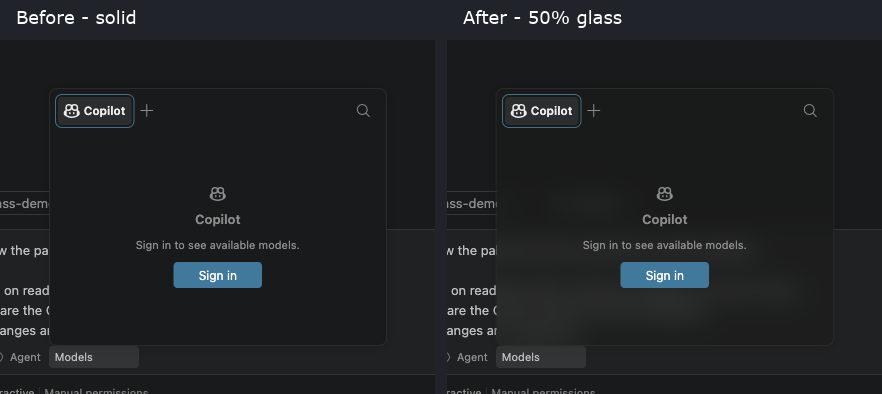

[Before](agents/models-tabbed-before.png) · [After](agents/models-tabbed-after.png) · [Full window before](agents/full/models-tabbed-before.png) · [Full window after](agents/full/models-tabbed-after.png)

### Mode picker

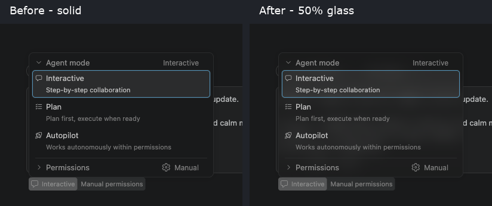

[Before](agents/mode-before.png) · [After](agents/mode-after.png) · [Full window before](agents/full/mode-before.png) · [Full window after](agents/full/mode-after.png)

### Permission picker

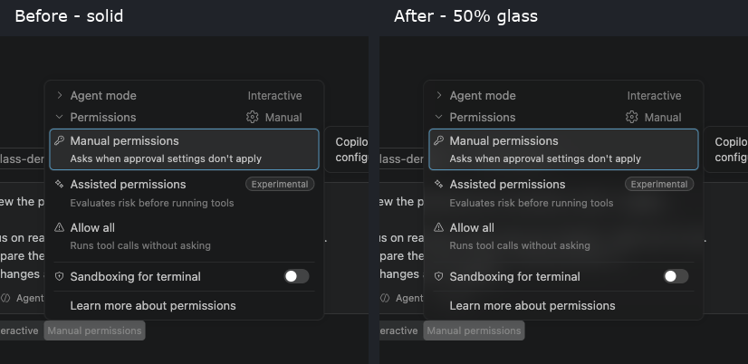

[Before](agents/permissions-before.png) · [After](agents/permissions-after.png) · [Full window before](agents/full/permissions-before.png) · [Full window after](agents/full/permissions-after.png)

### Workspace picker

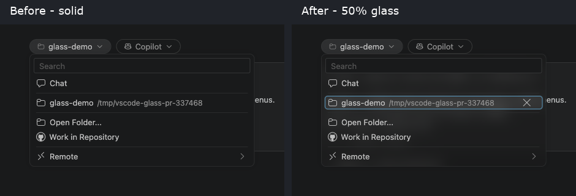

[Before](agents/workspace-before.png) · [After](agents/workspace-after.png) · [Full window before](agents/full/workspace-before.png) · [Full window after](agents/full/workspace-after.png)

### Branch picker

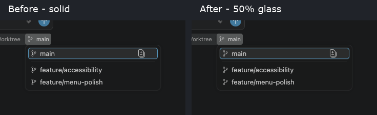

[Before](agents/branch-before.png) · [After](agents/branch-after.png) · [Full window before](agents/full/branch-before.png) · [Full window after](agents/full/branch-after.png)

### Workspace remote submenu

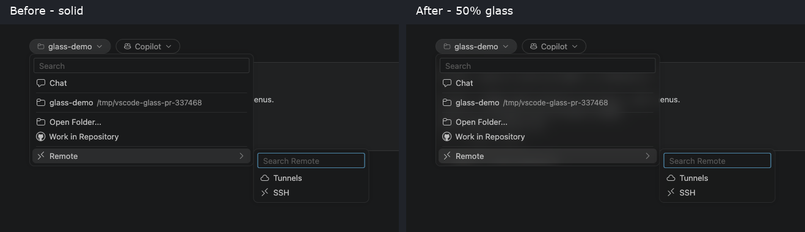

[Before](agents/remote-submenu-before.png) · [After](agents/remote-submenu-after.png) · [Full window before](agents/full/remote-submenu-before.png) · [Full window after](agents/full/remote-submenu-after.png)

